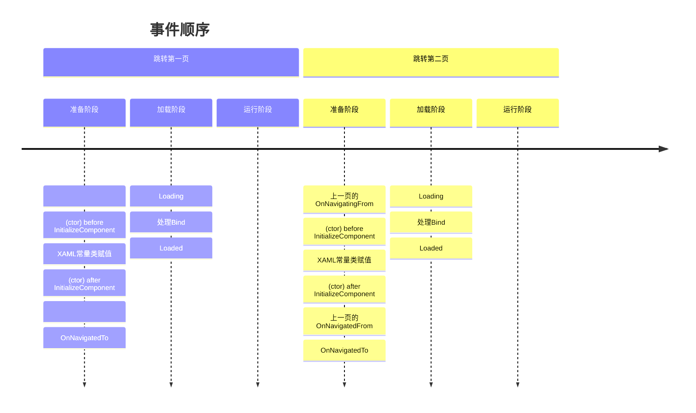
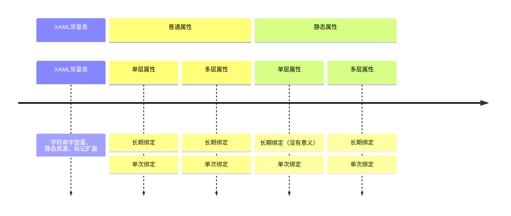

使用MVVM框架时，属性的赋值顺序一直都是令人头疼的点。
一方面希望参数赋值一步到位，以减少`OneWay`绑定的使用；
另一方面若顺序搞错了，后果轻则属性获得空值，可能需要触发`PropertyChanged`才能更新，
重则直接调用了`null`成员，直接导致程序崩溃。

所以本文我们通过实验的方法进行探讨，XAML的赋值顺序和事件的触发顺序是什么样的。

## 测试目标

首先我们需要明确，到底有多少内容需要分析。经过整理，得到以下内容：

事件和方法：

- 构造函数的`InitializeComponent`。
- 一般控件都有的`Loading`、`Loaded`事件。
- `Page`特有的`OnNavigatedTo`、`OnNavigatingFrom`、`OnNavigatedFrom`三个可重写方法。

XAML语法和绑定

- XAML中的字符串字面量赋值
- XAML中的静态资源（`StaticResource`）赋值
- 标记扩展（`MarkupExtension`）
- `{x:Bind}`（即`Mode=OneTime`）
- `{x:Bind Mode=OneWay}`
- `{x:Bind Mode=TwoWay}`
- `{x:Bind}`绑定普通属性
- `{x:Bind}`绑定静态属性
- `{x:Bind}`绑定普通属性的属性（多层）
- `{x:Bind}`绑定静态属性的属性（多层）

其中最后7个`{x:Bind}`相关的，前3个和后4个可以两两组合，共12种搭配
（虽然单层静态属性的长期绑定是没有意义的，因为无法触发它更新）。
而标记扩展无法内嵌`{x:Bind}`，只能内嵌静态资源和字符串字面量，显然和前两种相同。

有些人可能觉得以上的测试目标并不完整，对此我做一些解释。

- 析构方法：如同构造方法永远是第一个调用相同，析构永远最后调用。而且C#的GC系统使得程序员不能准确获知析构方法调用时间，所以析构方法自然不重要了。
- `{Binding}`：这个绑定是WPF中的旧绑定，效率和功能都比不上`{x:Bind}`，而且绝大部分情况都可以用`{x:Bind}`代替，所以不进行测试。
- `{TemplateBinding}`：在`ResourceDictionary`（自定义控件）中，因为用不了`{x:Bind}`，所以还是经常会用到这个绑定和`{Binding}`。但资源字典的控件并不是MVVM框架的（没有VM），所以测试它没有意义。

## 测试代码编写

为了以上测试样例，我编写了如下代码。
首先为了能得知赋值的先后顺序，我们需要在赋值时输出标志来记录。
我用一个最简单的Button子类，新建一个依赖属性，并在属性被赋值前输出。
其中`Tag`是对`MyButton`的标记，以区分不同`MyButton`：

```cs
using System.Diagnostics;
using Microsoft.UI.Xaml;
using Microsoft.UI.Xaml.Controls;

public class MyButton : Button
{
    public static readonly DependencyProperty MyContentProperty = DependencyProperty.Register(
        nameof(MyContent), typeof(object), typeof(MyButton), new PropertyMetadata("default"));

    public object MyContent
    {
        get => GetValue(MyContentProperty);
        set
        {
            Debug.WriteLine($"{Tag}: MyContent ({value})");
            SetValue(MyContentProperty, value);
        }
    }
}
```

然后我们编写.xaml.cs和.xaml文件，为了一次性测试所有目标事件，我选择`Page`进行测试。首先是.xaml.cs文件：

```cs
using System.Diagnostics;
using Microsoft.UI.Xaml;
using Microsoft.UI.Xaml.Controls;
using Microsoft.UI.Xaml.Navigation;

public sealed partial class BlankPage1 : Page
{
    public record Multi(string Value)
    {
        public string Value { get; set; } = Value;
    }

    public static string StaticString { get; set; } = "StaticString";

    public static Multi StaticString2 { get; set; } = new("StaticString2");

    public string String { get; set; } = "String";

    public Multi String2 { get; set; } = new("String2");

    public BlankPage1()
    {
        Debug.WriteLine("ctor before InitializeComponent");
        this.InitializeComponent();
        Debug.WriteLine("ctor after InitializeComponent");
    }

    private void BlankPage1_OnLoading(FrameworkElement sender, object args)
    {
        Debug.WriteLine("Loading");
    }

    private void BlankPage1_OnLoaded(object sender, RoutedEventArgs e)
    {
        Debug.WriteLine("Loaded");
    }

    protected override void OnNavigatedTo(NavigationEventArgs e)
    {
        Debug.WriteLine("OnNavigatedTo");
        base.OnNavigatedTo(e);
    }

    protected override void OnNavigatingFrom(NavigatingCancelEventArgs e)
    {
        Debug.WriteLine("OnNavigatingFrom");
        base.OnNavigatingFrom(e);
    }

    protected override void OnNavigatedFrom(NavigationEventArgs e)
    {
        Debug.WriteLine("OnNavigatedFrom");
        base.OnNavigatedFrom(e);
    }

    private void BlankPage1_OnUnloaded(object sender, RoutedEventArgs e)
    {
        Debug.WriteLine("Unloaded");
    }
}
```

接下来是.xaml文件：

```xml
<Page
    x:Class="App1.BlankPage1"
    ...
    Loaded="BlankPage1_OnLoaded"
    Loading="BlankPage1_OnLoading"
    Unloaded="BlankPage1_OnUnloaded">
    <Page.Resources>
        <x:String x:Key="String">StaticResource</x:String>
    </Page.Resources>
    <StackPanel>
        <local:MyButton MyContent="Const XAML String" Tag="Const" />
        <local:MyButton MyContent="{StaticResource String}" Tag="StaticResource" />
        <local:MyButton MyContent="{x:Bind local:BlankPage1.StaticString}" Tag="Static" />
        <local:MyButton MyContent="{x:Bind local:BlankPage1.StaticString, Mode=OneWay}" Tag="StaticOneWay" />
        <local:MyButton MyContent="{x:Bind local:BlankPage1.StaticString, Mode=TwoWay}" Tag="StaticTwoWay" />
        <local:MyButton MyContent="{x:Bind local:BlankPage1.StaticString2.Value}" Tag="MultiStatic" />
        <local:MyButton MyContent="{x:Bind local:BlankPage1.StaticString2.Value, Mode=OneWay}" Tag="MultiStaticOneWay" />
        <local:MyButton MyContent="{x:Bind local:BlankPage1.StaticString2.Value, Mode=TwoWay}" Tag="MultiStaticTwoWay" />
        <local:MyButton MyContent="{x:Bind String}" Tag="Bind" />
        <local:MyButton MyContent="{x:Bind String, Mode=OneWay}" Tag="OneWay" />
        <local:MyButton MyContent="{x:Bind String, Mode=TwoWay}" Tag="TwoWay" />
        <local:MyButton MyContent="{x:Bind String2.Value}" Tag="Multi" />
        <local:MyButton MyContent="{x:Bind String2.Value, Mode=OneWay}" Tag="MultiOneWay" />
        <local:MyButton MyContent="{x:Bind String2.Value, Mode=TwoWay}" Tag="MultiTwoWay" />
    </StackPanel>
</Page>
```

共14条，其中1条常量字符串，1条静态资源，还有12条是各种`{x:Bind}`。

## 运行结果

```plaintext
Ctor before InitializeComponent
: MyContent (Const XAML String)
: MyContent (StaticResource)
Ctor after InitializeComponent
OnNavigatedTo
Loading
OneWay: MyContent (String)
TwoWay: MyContent (String)
Bind: MyContent (String)
MultiOneWay: MyContent (String2)
MultiTwoWay: MyContent (String2)
Multi: MyContent (String2)
StaticOneWay: MyContent (StaticString)
StaticTwoWay: MyContent (StaticString)
Static: MyContent (StaticString)
MultiStaticOneWay: MyContent (StaticString2)
MultiStaticTwoWay: MyContent (StaticString2)
MultiStatic: MyContent (StaticString2)
Loaded
```

再次导航该页面得：

```plaintext
OnNavigatingFrom
ctor before InitializeComponent
: MyContent (Const XAML String)
: MyContent (StaticResource)
ctor after InitializeComponent
OnNavigatedFrom
OnNavigatedTo
Loading
OneWay: MyContent (String)
TwoWay: MyContent (String)
Bind: MyContent (String)
MultiOneWay: MyContent (String2)
MultiTwoWay: MyContent (String2)
Multi: MyContent (String2)
StaticOneWay: MyContent (StaticString)
StaticTwoWay: MyContent (StaticString)
Static: MyContent (StaticString)
MultiStaticOneWay: MyContent (StaticString2)
MultiStaticTwoWay: MyContent (StaticString2)
MultiStatic: MyContent (StaticString2)
Loaded
Unloaded
```

接着，随机打乱控件在XAML中的顺序，
发现常量字符串和静态资源与顺序有关，同一类的`OneWay`和`TwoWay`之间也与顺序有关，其他都不变。

## 分析结果

### 事件顺序

首先分析各种事件，发现结果可以分成几块：

```plaintext
ctor before InitializeComponent
// 一些常量型的绑定
ctor after InitializeComponent
OnNavigatedTo
Loading
// 其他的绑定
Loaded
// 进入页面主要生命周期
OnNavigatingFrom
// 新页面的ctor
OnNavigatedFrom
// 新页面 OnNavigatedTo
// 新页面Loading -> Loaded
Unloaded
```

大致顺序如下图所示（为了左右对称，跳转第一页没有的方法留空占位）：



### 绑定顺序

常量和静态资源（也和常量差不多）最先赋值并且无所谓顺序很好理解，因为本来也不依赖任何其他东西。

`{x:Bind}`中，同一类的`OneWay`和`TwoWay`之间也无所谓顺序，因为既然已经允许更新了，当然谁先谁后赋值无所谓了，最后总会更新为最新的值。
`{x:Bind}`的默认值`OneTime`位于三者的最后，是因为它只设置一次，应该保证它尽量设置到最新的值，也很好理解。

但其他的`{x:Bind}`有顺序却很奇怪，假如我把多层属性换成控件，那如果我引用了其他控件的属性，是绑定到静态的属性上的话，就会出现`null`的问题吗？
我立即设计样例测试：

```xml
<local:MyButton x:Name="ButtonStatic" Tag="{x:Bind local:BlankPage1.StaticString}" />
<local:MyButton MyContent="{x:Bind ButtonStatic.Tag}" Tag="ButtonStatic" />
<local:MyButton MyContent="{x:Bind ButtonStatic.Tag, Mode=OneWay}" Tag="ButtonStaticOneWay" />
<local:MyButton MyContent="{x:Bind ButtonStatic.Tag, Mode=TwoWay}" Tag="ButtonStaticTwoWay" />
```

得到结果：

```plaintext
ButtonStaticOneWay: MyContent ()
ButtonStaticTwoWay: MyContent ()
ButtonStatic: MyContent ()
ButtonStaticOneWay: MyContent (StaticString)
ButtonStaticTwoWay: MyContent (StaticString)
```

果不其然，一开始三者都为空值，静态赋值后使长期绑定的两个控件更新了，但另一个就更新不到了。

我还去测试两层和三层属性的先后顺序，发现和层数无关，说明这只和是不是只有一层有关。

综上，我们得到了绑定属性的赋值顺序，并按从上到下的顺序判断：

- 先普通属性绑定、后静态属性绑定
- 先单层属性绑定、后多层属性绑定
- 先长期绑定（`OneWay`、`TwoWay`）、后单次绑定（`OneTime`）

顺序如图：



当以上三个特征都是相同的时，顺序是无所谓的（即取决于XAML从上至下的出现顺序）。

## 结论

虽然绑定顺序看起来很复杂，但没必要去记。只需要遇到相关问题时，能考虑到此处可能出现的BUG即可。

静态资源虽然看起来像是常量，但它其实是可以使用绑定的：

```cs
public class Test
{
    public object Value { get; set; }
}
```

```xml
<Page.Resources>
    <local:Test x:Key="String2" Value="{x:Bind String}" />
</Page.Resources>
```

但这样很容易导致误判赋值顺序导致问题。所以如非必要，不要在静态资源上使用绑定。

对于事件的顺序，熟记于心的很有用的，但也不需要死记硬背，经常写代码自然就能记得。
