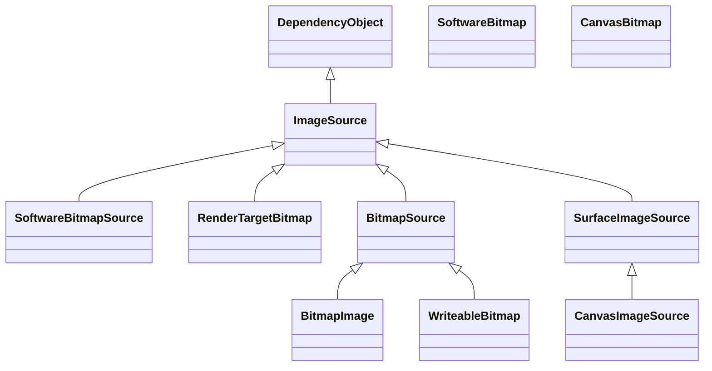

`ImageSource`相关类型是最常用的API之一，用来在界面中展示图片。
但从WPF开始，我就一直分不清`ImageSource`、`BitmapImage`、`Bitmap`的区别。
甚至还因为它们名称带“Source”，错认为“Source”类才是承载图片的源、核心，现在看来真是大错特错了。
本文将会纠正这些概念。

首先请看WinUI 3中`ImageSource`相关的类型继承表。

## 名称辨析

首先先要理解何为“Source”才好对这些类型做个初步的印象。

“Source”指的是`Image`控件使用的源，而不是`Bitmap`等类型的源。
所以“Source”的意思是，它们不一定包含真正的图片数据，而是有渲染能力的，可以被`Image`或`ImageBrush`等上呈现的包装、“源”。
例如`BitmapImage`可以构造之后再`SetSource()`、`SoftwareBitmapSource`可以构造之后再`SetBitmapAsync()`。

接下来可以看到类图里有两个“Bitmap”结尾的类型，它们的重点落在“Bitmap”上，而不是强调是一个“源”。所以这个才是真正的位图，真正存储了每一位像素的对象。
如果你在项目中尝试构造或使用这个类型，可以发现构建他们的时候，必须从流或缓冲区中读取图片数据，而不是像`ImageSource`作为构造后的可选行为。
这再次验证了它们是真正存储了图片的类型。

不过`ImageSource`衍生和相关类型错综复杂，本文将会一一辨析。

## 具体类型辨析

### [SoftwareBitmap](https://learn.microsoft.com/uwp/api/windows.graphics.imaging.softwarebitmap)和[CanvasBitmap](https://microsoft.github.io/Win2D/WinUI3/html/T_Microsoft_Graphics_Canvas_CanvasBitmap.htm)

`SoftwareBitmap`类似于WPF中的`Bitmap`，就是一个容器包含了一个图片的数据，它提供了最简单的长、宽、像素类型等基础信息，以便与普通的缓冲区、数组等区分开来。

`CanvasBitmap`和`SoftwareBitmap`类似，只是专门给Win2D使用的。
Win2D的API可以把`CanvasBitmap`直接画到屏幕上。

### [BitmapImage](https://learn.microsoft.com/windows/windows-app-sdk/api/winrt/microsoft.ui.xaml.media.imaging.bitmapimage)和[SoftwareBitmapSource](https://learn.microsoft.com/windows/windows-app-sdk/api/winrt/microsoft.ui.xaml.media.imaging.softwarebitmapsource)

一般的应用中，最常用的源就是`BitmapImage`了。而第二常用的`SoftwareBitmapSource`虽然据[MSDN所称](https://learn.microsoft.com/windows/windows-app-sdk/api/winrt/microsoft.ui.xaml.media.imaging.softwarebitmapsource#remarks)占更大的空间，但它实现`IDispose`可以随时销毁的功能也十分诱人。

MSDN为什么说`SoftwareBitmapSource`没有压缩呢？这得从它们的原理理解：

1. 首先我们有一份图片数据，它可能被缓冲区或流包装，并且可能存在于内存或磁盘中。
2. 接着我们新建一个`BitmapImage`或`SoftwareBitmapSource`，然后我们调用方法设置它的源数据（从缓冲区或流中读）。
3. 它的方法将我们提供的数据读取出来，复制一份存到内存中（此时我们提供的那份就可以销毁了）。
4. 我们把`BitmapImage`或`SoftwareBitmapSource`赋值给`Image.Source`，于是`Image`控件开始渲染图片。
5. `BitmapImage`或`SoftwareBitmapSource`将自己存的数据再复制到GPU或CPU中渲染显示。若复制到GPU，则占用显存。若复制到CPU，则[再次占用一份内存](https://learn.microsoft.com/windows/win32/direct3darticles/directx-warp)。

`BitmapImage`或`SoftwareBitmapSource`的区别正在于第3步。
`BitmapImage`存储的是压缩后的图片格式（JPG或PNG等），而`SoftwareBitmapSource`存储的是Bitmap（BMP）。
用过这两种图片格式的人一定知道BMP的大小，所以大部分情况下我们仍然应该使用`BitmapImage`。

有些读者看到第5步可能在想，既然第2步复制完后可以销毁，那第5步是不是也可以这样做？
很可惜并不行，如果写过DirectX的朋友应该都知道会经常丢失设备（Device lost），例如更改窗口大小等操作都会导致丢失设备。丢失后就需要重新执行第5步（读取内存到GPU/CPU中）。
所以我们不能销毁内存中的那份。

### [WriteableBitmap](https://learn.microsoft.com/windows/windows-app-sdk/api/winrt/microsoft.ui.xaml.media.imaging.writeablebitmap)

`WriteableBitmap`也是一个从WPF起就一脉相承的API，主要是以其可以快速修改部分像素而效率较高。在WinUI 3中类似于可以当`ImageSource`使用的`SoftwareBitmap`。

### [RenderTargetBitmap](https://learn.microsoft.com/windows/windows-app-sdk/api/winrt/microsoft.ui.xaml.media.imaging.rendertargetbitmap)

`RenderTargetBitmap`用于给现有的控件截图，截图后可以交给`Image`显示。这个API虽然叫“Bitmap”，但实际上不包含位图。而是使用框架内部的Composition的API，把控件的`Visual`截了个`CompositionSurface`的快照。
由于它是个图面（`Surface`），所以如果GPU支持则存在显存上，不支持则存在内存里。

### [CanvasImageSource](https://microsoft.github.io/Win2D/WinUI2/html/T_Microsoft_Graphics_Canvas_UI_Xaml_CanvasImageSource.htm)

这是一个Win2D的API，类似于一个画布，可以直接在上面画图片、文字、几何图形等，然后放到`Image`上呈现。
它与[`CanvasControl`](https://microsoft.github.io/Win2D/WinUI2/html/T_Microsoft_Graphics_Canvas_UI_Xaml_CanvasControl.htm)功能相同，如果没有必要，可以根据[Win2D建议](https://microsoft.github.io/Win2D/WinUI2/html/T_Microsoft_Graphics_Canvas_UI_Xaml_CanvasImageSource.htm)使用`CanvasControl`代替。
如果需要一定要使用，也可以对照`CanvasControl`来学习它的用法。
